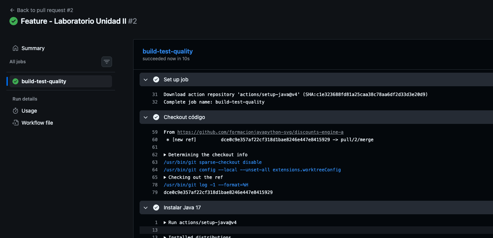

# 💸 Discount Engine (Java)

Motor de descuentos desarrollado en Java puro, aplicando principios de POO, buenas prácticas de seguridad y calidad de código.

---

## 🚀 Características

- Value Object `Money` (inmutable)
- Entidad `Item`
- Agregado `Cart`
- Reglas de descuento:
  - Threshold (por monto)
  - Coupon (por código seguro)
  - Bulk (por cantidad)
- Sistema de pruebas sin frameworks (TestRunner)
- Validación de calidad con Checkstyle
- CI/CD con GitHub Actions

---

## 📂 Estructura
- src/main/java/Main.java
- checkstyle.xml
- scripts/checkstyle.sh
- .github/workflows/ci.yml

---

## ⚙️ Requisitos

- Java 17 o superior
- Bash (Mac/Linux)
- Git

---


## Evidencias



## ▶️ Cómo ejecutar el proyecto

### 1. Compilar

```bash
javac src/main/java/Main.java


